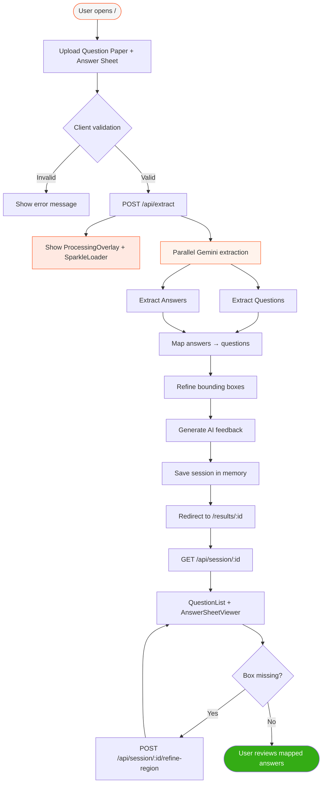
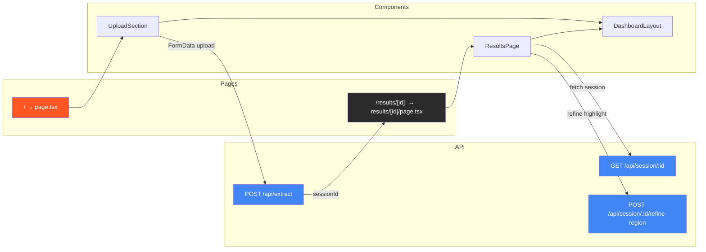
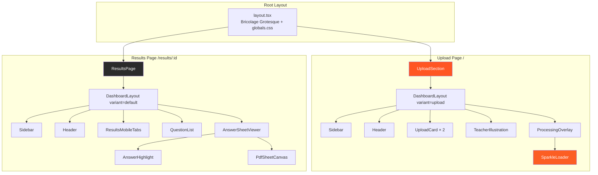
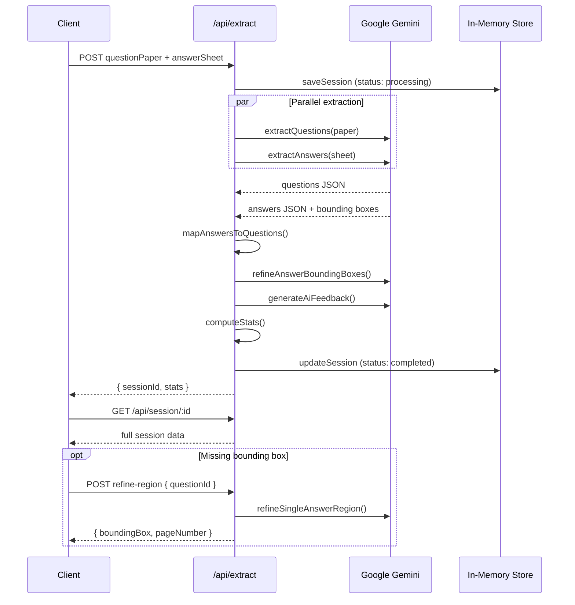

<div align="center">

<!-- Animated sparkle loader (inline SVG) -->
<svg width="64" height="64" viewBox="0 0 64 64" xmlns="http://www.w3.org/2000/svg">
  <defs>
    <linearGradient id="sparkle-grad" x1="0%" y1="0%" x2="100%" y2="100%">
      <stop offset="0%" stop-color="#fb975d"/>
      <stop offset="100%" stop-color="#fc5e24"/>
    </linearGradient>
  </defs>
  <g fill="url(#sparkle-grad)">
    <polygon points="32,4 36,24 56,28 36,32 32,52 28,32 8,28 28,24">
      <animateTransform attributeName="transform" type="rotate" from="0 32 28" to="360 32 28" dur="3s" repeatCount="indefinite"/>
    </polygon>
    <circle cx="50" cy="12" r="3" opacity="0.8">
      <animate attributeName="opacity" values="0.3;1;0.3" dur="1.5s" repeatCount="indefinite"/>
    </circle>
    <circle cx="14" cy="44" r="2" opacity="0.6">
      <animate attributeName="opacity" values="0.2;0.9;0.2" dur="2s" repeatCount="indefinite"/>
    </circle>
  </g>
</svg>

# VedaAI — Assessment Extraction

**AI-powered answer sheet extraction & question mapping**

[](https://nextjs.org/)
[](https://www.typescriptlang.org/)
[](https://tailwindcss.com/)
[](https://ai.google.dev/)
[](LICENSE)

Upload a **question paper** and **answer sheet** — Gemini AI extracts questions, reads handwritten answers, maps them together, and highlights answers on the sheet.

[Design Reference (Figma)](https://www.figma.com/design/GEjt1rt1s7AXvkcr4t8muE/VedaAI-Hiring-Assignment) · [Live Demo](#) *(add URL after deploy)*

</div>

---

## Table of Contents

- [Features](#features)
- [Tech Stack](#tech-stack)
- [Application Flow](#application-flow)
- [Route & Path Flow](#route--path-flow)
- [Folder Structure](#folder-structure)
- [Component Architecture](#component-architecture)
- [Design System](#design-system)
- [UI Animations](#ui-animations)
- [API Reference](#api-reference)
- [AI Pipeline](#ai-pipeline)
- [Getting Started](#getting-started)
- [Environment Variables](#environment-variables)
- [Deployment](#deployment)
- [Assumptions & Limitations](#assumptions--limitations)
- [License](#license)

---

## Features

| Feature | Description |
|---------|-------------|
| **Dual Upload** | Drag-and-drop question paper + answer sheet (PDF, JPG, PNG, WebP — max 10 MB) |
| **AI Extraction** | Parallel Gemini calls extract structured questions and handwritten answers |
| **Smart Mapping** | Matches answers to questions by number — handles out-of-order & sub-questions |
| **Bounding Boxes** | Highlights answer regions on the sheet with zoom & page navigation |
| **Region Refinement** | On-demand AI refinement for missing or imprecise highlight boxes |
| **AI Feedback** | Per-question feedback on answer quality and completeness |
| **Split Dashboard** | Question list + interactive answer sheet viewer side by side |
| **Responsive** | Mobile tab layout; desktop two-column grid — matches Figma design |

---

## Tech Stack

```
┌─────────────────────────────────────────────────────────────┐
│                        FRONTEND                             │
│  Next.js 15 (App Router) · React 19 · TypeScript 5        │
│  Tailwind CSS 4 · Bricolage Grotesque · Lucide Icons       │
│  pdfjs-dist (PDF rendering)                                 │
├─────────────────────────────────────────────────────────────┤
│                         BACKEND                             │
│  Next.js API Routes · In-memory session store               │
│  Google Generative AI SDK (@google/generative-ai)           │
├─────────────────────────────────────────────────────────────┤
│                      INFRASTRUCTURE                         │
│  Vercel (deployment) · No database required                 │
└─────────────────────────────────────────────────────────────┘
```

| Layer | Technology | Purpose |
|-------|-----------|---------|
| **Framework** | Next.js 15 | App Router, SSR, API routes |
| **Language** | TypeScript 5 | End-to-end type safety |
| **UI** | React 19 | Component model |
| **Styling** | Tailwind CSS 4 | Utility-first CSS with custom Veda theme |
| **Font** | Bricolage Grotesque | Brand typography via `next/font` |
| **Icons** | Lucide React + custom SVG | `VedaIcons`, `VedaLogo` |
| **AI** | Google Gemini (`gemini-3.6-flash`) | Multimodal document extraction |
| **PDF** | pdfjs-dist | Client-side PDF page rendering |
| **Storage** | In-memory `Map` | Session data (1 hr TTL, max 50 sessions) |
| **IDs** | uuid v4 | Session identifiers |

---

## Application Flow



---

## Route & Path Flow



### Page Routes

| Path | File | Component | Description |
|------|------|-----------|-------------|
| `/` | `src/app/page.tsx` | `UploadSection` | Home — dual file upload & extraction trigger |
| `/results/[id]` | `src/app/results/[id]/page.tsx` | `ResultsPage` | Results dashboard for a session |

### API Routes

| Method | Path | File | Description |
|--------|------|------|-------------|
| `POST` | `/api/extract` | `src/app/api/extract/route.ts` | Upload files, run AI pipeline, return `sessionId` |
| `GET` | `/api/session/[id]` | `src/app/api/session/[id]/route.ts` | Fetch session data, mapped answers & stats |
| `POST` | `/api/session/[id]/refine-region` | `src/app/api/session/[id]/refine-region/route.ts` | Refine bounding box for a single question |

---

## Folder Structure

```
AI Assessment Extraction/
│
├── public/
│   ├── favicon.svg
│   └── images/                    # Static assets (teacher illustration, icons, etc.)
│
├── src/
│   ├── app/                       # Next.js App Router
│   │   ├── api/
│   │   │   ├── extract/
│   │   │   │   └── route.ts       # POST — upload & AI extraction pipeline
│   │   │   └── session/
│   │   │       └── [id]/
│   │   │           ├── route.ts           # GET — fetch session results
│   │   │           └── refine-region/
│   │   │               └── route.ts     # POST — refine answer bounding box
│   │   ├── results/
│   │   │   └── [id]/
│   │   │       └── page.tsx       # Results page entry
│   │   ├── globals.css            # Tailwind theme + Veda design tokens
│   │   ├── layout.tsx             # Root layout (Bricolage Grotesque font)
│   │   └── page.tsx               # Home page entry
│   │
│   ├── components/
│   │   ├── icons/
│   │   │   ├── VedaIcons.tsx      # Custom icon components
│   │   │   └── VedaLogo.tsx       # Brand logo
│   │   ├── layout/
│   │   │   ├── DashboardLayout.tsx  # Shell: sidebar + header + main
│   │   │   ├── Header.tsx           # Top bar with back navigation
│   │   │   └── Sidebar.tsx          # Collapsible nav sidebar
│   │   ├── upload/
│   │   │   ├── UploadSection.tsx      # Main upload page orchestrator
│   │   │   ├── UploadCard.tsx         # Drag-and-drop file card
│   │   │   ├── ProcessingOverlay.tsx  # Full-screen extraction loading state
│   │   │   ├── SparkleLoader.tsx      # Animated sparkle loader
│   │   │   └── TeacherIllustration.tsx # Hero illustration
│   │   └── results/
│   │       ├── ResultsPage.tsx        # Results page orchestrator
│   │       ├── QuestionList.tsx       # Scrollable mapped answer list
│   │       ├── AnswerSheetViewer.tsx  # Sheet viewer with zoom & pagination
│   │       ├── AnswerHighlight.tsx    # Bounding box overlay on sheet
│   │       ├── PdfSheetCanvas.tsx     # PDF page renderer (pdfjs-dist)
│   │       └── ResultsMobileTabs.tsx  # Mobile Questions / Sheet tabs
│   │
│   └── lib/                       # Shared logic & utilities
│       ├── gemini.ts              # AI extraction, mapping, refinement, feedback
│       ├── storage.ts             # In-memory session store (TTL + LRU)
│       ├── types.ts               # TypeScript interfaces
│       ├── validation.ts          # File type/size validation
│       ├── bounding-box.ts        # Box normalization, padding, estimation
│       ├── feedback.ts            # AI feedback text builder
│       └── api-client.ts          # Safe JSON response parser
│
├── .env.example                   # Environment variable template
├── .gitignore
├── next.config.ts
├── package.json
├── postcss.config.mjs
├── tsconfig.json
└── README.md
```

---

## Component Architecture



### Component Responsibilities

| Component | Path | Role |
|-----------|------|------|
| `DashboardLayout` | `components/layout/` | App shell — sidebar, header, gradient background, responsive padding |
| `Sidebar` | `components/layout/` | Collapsible navigation with toolkit styling |
| `Header` | `components/layout/` | Back button, mobile/desktop variants |
| `UploadSection` | `components/upload/` | State management, form submit, error handling, navigation |
| `UploadCard` | `components/upload/` | Drag-and-drop zone, file preview, validation feedback |
| `ProcessingOverlay` | `components/upload/` | Full-page loading state during extraction |
| `SparkleLoader` | `components/upload/` | Animated sparkle icon during processing |
| `TeacherIllustration` | `components/upload/` | Hero image on upload page |
| `ResultsPage` | `components/results/` | Fetches session, manages selection & region refinement |
| `QuestionList` | `components/results/` | Mapped answers with status badges, scores, copy |
| `AnswerSheetViewer` | `components/results/` | Zoom controls, page nav, highlight positioning |
| `AnswerHighlight` | `components/results/` | Colored bounding box overlay on answer region |
| `PdfSheetCanvas` | `components/results/` | Renders PDF pages via pdfjs-dist |
| `ResultsMobileTabs` | `components/results/` | Toggle between Questions and Sheet on mobile |

---

## Design System

Based on the [VedaAI Figma assignment](https://www.figma.com/design/GEjt1rt1s7AXvkcr4t8muE/VedaAI-Hiring-Assignment).

### Color Palette

| Token | Value | Usage |
|-------|-------|-------|
| `veda-orange` | `#ff5623` | Primary brand, CTAs, highlights |
| `veda-orange-light` | `rgba(255,147,80,0.15)` | Title highlight backgrounds |
| `veda-dark` | `#2b2b2b` | Headings |
| `veda-text` | `#303030` | Body text |
| `veda-text-muted` | `rgba(94,94,94,0.8)` | Secondary text |
| `veda-bg-off-white` | `#f6f6f6` | Page backgrounds |
| `veda-success` | `#34ac15` | Answered / high confidence |
| `veda-warning` | `#e3600f` | Partial / medium confidence |
| `veda-danger` | `#c0350a` | Unanswered / errors |

### Typography

- **Font:** Bricolage Grotesque (weights 400–800)
- **Headings:** Bold, tight tracking (`-0.04em`)
- **Highlight spans:** `.veda-title-highlight` — orange text on soft orange background

### Layout

| Breakpoint | Behavior |
|------------|----------|
| **Mobile** (`< lg`) | Stacked layout, mobile tabs on results page |
| **Desktop** (`≥ lg`) | Sidebar + two-column results grid, rounded `40px` main panel |

### Utility Classes (`globals.css`)

| Class | Effect |
|-------|--------|
| `.veda-gradient-bg` | Upload page gradient (`#f5f5f5 → #e9e5e5`) |
| `.veda-gradient-bg-alt` | Results page gradient (`#eeeeee → #dadada`) |
| `.veda-title-highlight` | Orange pill highlight behind title text |
| `.veda-sidebar-shadow` | Deep sidebar drop shadow |
| `.veda-toolkit-shadow` | Glassmorphic toolkit button shadow |
| `.upload-dashed` | Dashed upload border with orange hover state |

---

## UI Animations

The app uses purposeful motion to communicate processing state and interactivity.

### In-App Animations

| Animation | Location | Description |
|-----------|----------|-------------|
| **Shimmer text** | `ProcessingOverlay` | `.veda-extracting-shimmer` — gradient sweep across "Extracting..." text |
| **Sparkle loader** | `SparkleLoader` | Rotating sparkle graphic with pulsing accent dots |
| **Upload hover** | `UploadCard` | Dashed border transitions to orange on drag-over / hover |
| **Button transition** | `UploadSection` | CTA opacity and shadow on enable/disable |
| **Highlight pulse** | `AnswerHighlight` | Selected answer box emphasis on the sheet |

### Shimmer CSS

```css
@keyframes shimmer {
  0%   { background-position: 120% center; }
  100% { background-position: -120% center; }
}
```

Applied via `.veda-extracting-shimmer` — a `2.2s` infinite linear gradient text animation.

---

## API Reference

### `POST /api/extract`

Upload question paper and answer sheet, run the full AI pipeline.

**Request:** `multipart/form-data`

| Field | Type | Required |
|-------|------|----------|
| `questionPaper` | `File` | Yes |
| `answerSheet` | `File` | Yes |

**Success `200`:**

```json
{
  "sessionId": "uuid",
  "status": "completed",
  "stats": {
    "totalQuestions": 10,
    "answered": 8,
    "unanswered": 1,
    "partial": 1
  }
}
```

**Errors:** `400` (validation), `422` (extraction failed), `500` (server error)

---

### `GET /api/session/:id`

Retrieve a completed extraction session.

**Success `200`:**

```json
{
  "id": "uuid",
  "status": "completed",
  "questionPaperName": "paper.pdf",
  "answerSheetName": "answers.jpg",
  "answerSheetMime": "image/jpeg",
  "answerSheetBase64": "...",
  "questions": [...],
  "mappedAnswers": [...],
  "stats": { "totalQuestions": 10, "answered": 8, "unanswered": 1, "partial": 1 },
  "createdAt": "2026-08-30T00:00:00.000Z"
}
```

**Errors:** `404` (session not found or expired)

---

### `POST /api/session/:id/refine-region`

Refine the bounding box for a single answer on the sheet.

**Request body:**

```json
{ "questionId": "q3a" }
```

**Success `200`:**

```json
{
  "questionId": "q3a",
  "boundingBox": { "x": 10, "y": 25, "width": 70, "height": 12 },
  "pageNumber": 1
}
```

**Errors:** `400`, `404`, `422`, `500`

---

## AI Pipeline



### Pipeline Steps

1. **Validate** — File type (PDF/JPG/PNG/WebP) and size (≤ 10 MB)
2. **Extract Questions** — Structured JSON with numbers, text, types, marks, sub-questions
3. **Extract Answers** — Handwritten text, confidence, bounding boxes, page numbers
4. **Map** — Deterministic matching by `questionNumber:subLabel` key
5. **Refine Boxes** — AI pass to tighten highlight regions on the sheet
6. **Feedback** — Per-question AI commentary on answer quality
7. **Store** — Session saved in memory with 1-hour TTL

---

## Getting Started

### Prerequisites

- **Node.js** 18+
- **Google Gemini API key** — [Get one free at AI Studio](https://aistudio.google.com/apikey)

### Installation

```powershell
# Clone the repository
git clone https://github.com/vitthalsawant/AI-Assessment-Extraction-Answer-Mapping---Assignment.git
cd "AI Assessment Extraction"

# Install dependencies
npm install

# Configure environment
Copy-Item .env.example .env
# Edit .env and set GEMINI_API_KEY

# Start development server
npm run dev
```

Open **http://localhost:3000** in your browser.

### Scripts

| Command | Description |
|---------|-------------|
| `npm run dev` | Start development server |
| `npm run build` | Production build |
| `npm run start` | Start production server |
| `npm run lint` | Run ESLint |

---

## Environment Variables

| Variable | Required | Default | Description |
|----------|----------|---------|-------------|
| `GEMINI_API_KEY` | **Yes** | — | Google Gemini API key |
| `GEMINI_MODEL` | No | `gemini-3.6-flash` | Model override (falls back to `gemini-flash-latest`) |

> **Never commit `.env` or `.env.local`** — they are excluded via `.gitignore`.

---

## Deployment

### Vercel (Recommended)

1. Push code to GitHub
2. Import the repo in [Vercel](https://vercel.com)
3. Add `GEMINI_API_KEY` under **Environment Variables**
4. Deploy — Vercel auto-detects Next.js
5. Update the Live Demo link at the top of this README

```powershell
# Optional: deploy via Vercel CLI
npx vercel --prod
```

---

## Assumptions & Limitations

| Area | Detail |
|------|--------|
| **Sessions** | In-memory only — data lost on restart, expires after 1 hour |
| **Capacity** | Max 50 concurrent sessions (LRU eviction) |
| **Language** | Optimized for English question papers and answers |
| **Sheets** | One student answer sheet per extraction session |
| **Bounding boxes** | AI-estimated — approximate, refined on demand |
| **Auth** | None — open demo access |
| **PDFs** | Sent directly to Gemini; complex multi-page layouts may vary |

---

## License

MIT © 2026 VedaAI Assessment Extraction
